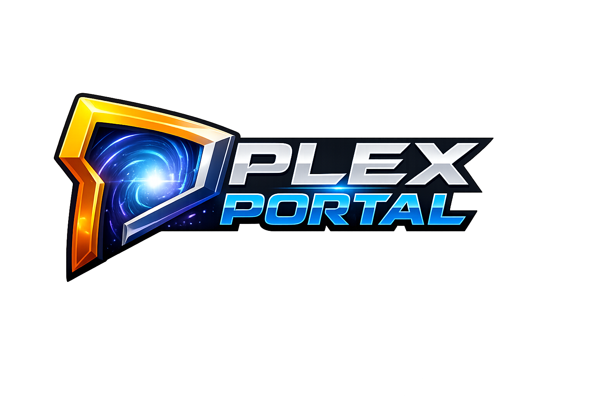
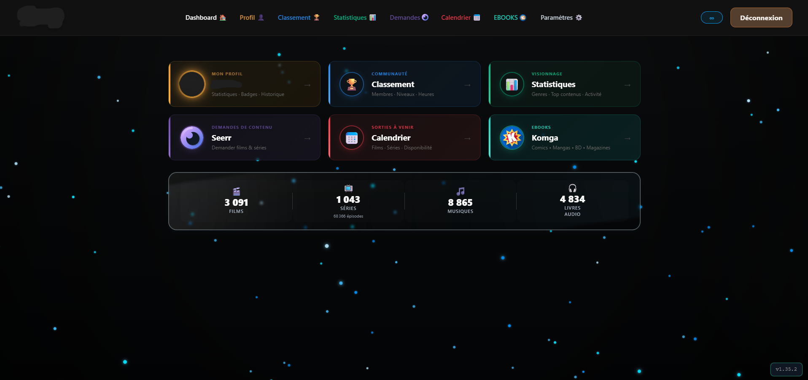
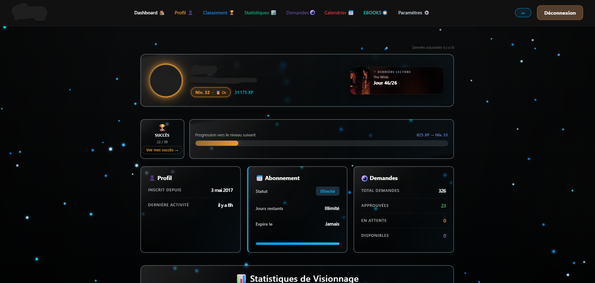
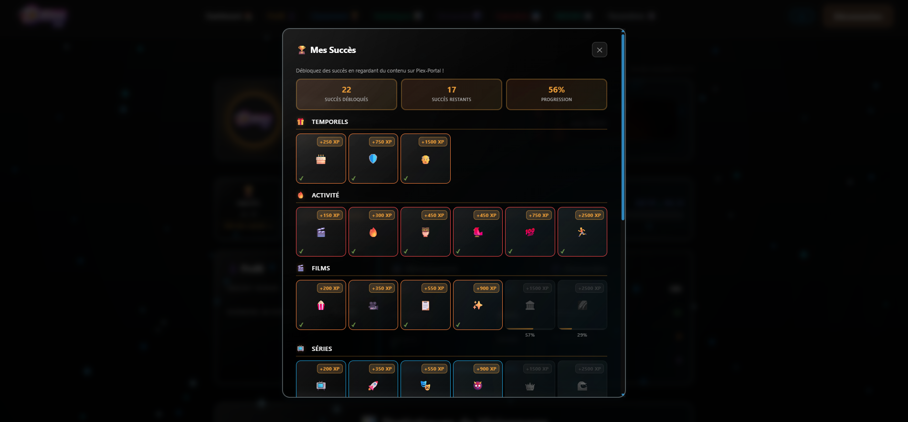
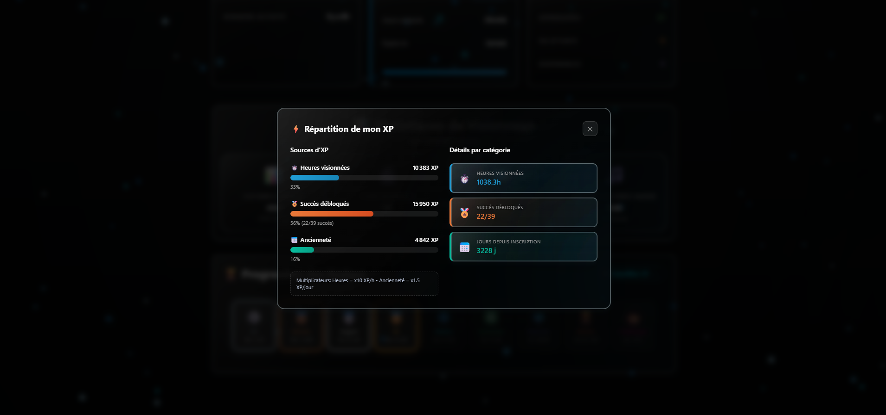
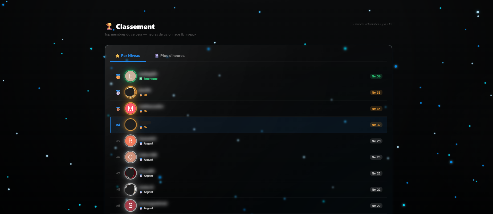
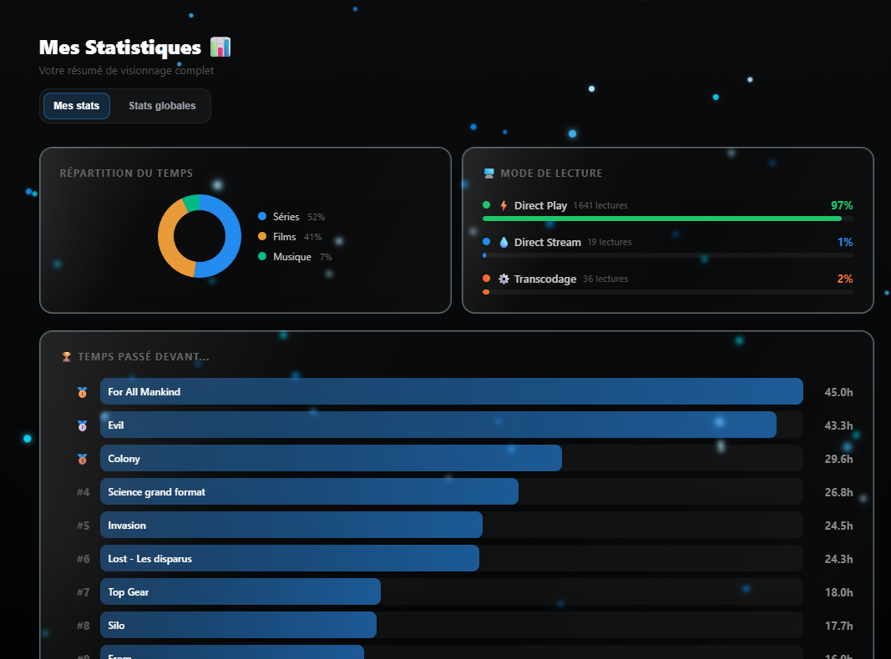
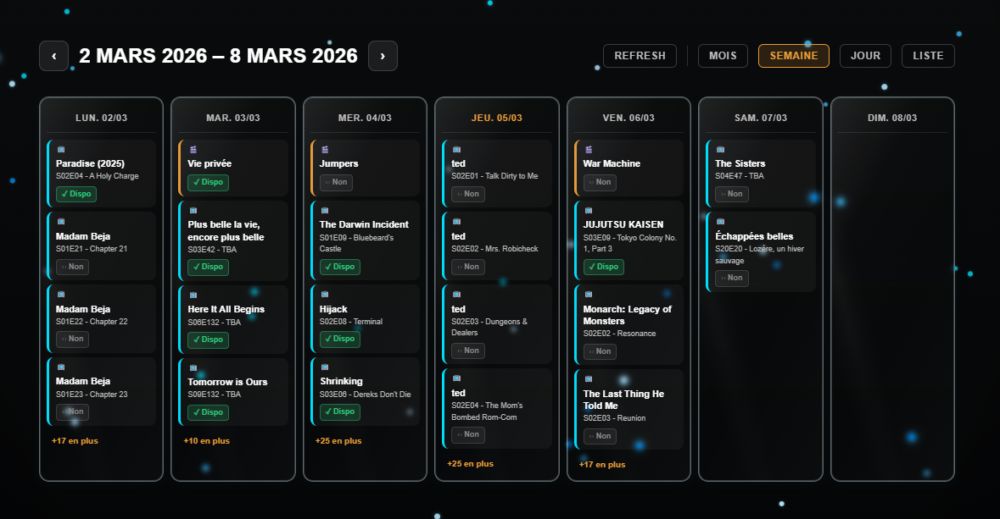


<p align="center">
  
</p>


Application web pour gérer votre accès Plex, afficher abonnements, statistiques de visionnage, et accéder à Seerr via SSO intégré.

---

## 📦 Dernière Version & Changelog

**📖 [Voir le CHANGELOG complet](./CHANGELOG.md)** pour l'historique des versions et fonctionnalités


---

##  Fonctionnalités

🔐 **Authentification Plex** : Connexion via compte Plex (OAuth)

📊 **Dashboard** : Vue d'ensemble (abonnement, statistiques, demandes Seerr)

🎫 **Abonnements Wizarr** : Date d'expiration et groupe (requis pour toutes les fonctionnalités)

📈 **Statistiques Tautulli** : Historique de visionnage, temps total, collections (requis pour toutes les fonctionnalités)

🛡️ **Intégration Seerr (SSO)** : Accès à Seerr dans une iframe full-page sans re-connexion

🏆 **Système XP & Succès** : Points d'expérience et badges selon l'activité de visionnage

👤 **Page Profil** : Stats personnelles, demandes Seerr, succès débloqués

📅 **Calendrier des sorties** : Sorties films/séries à venir depuis Radarr et Sonarr (4 vues : semaine, mois, jour, liste)

🔄 **Reverse Proxy Automatique** : Détection auto via headers `X-Forwarded-*`

⚡ **Configuration Minimale** : Juste `SESSION_SECRET` en obligatoire

---

## Captures d'ecran









---

##  État des traductions

- **Français** : `100%` (référence principale du projet)
- **Anglais** : `~82%` (estimation actuelle de couverture UI)

---

##  Démarrage rapide

### Prérequis

🛠️ Docker & Docker Compose
👤 Compte Plex
🔗 Wizarr, Tautulli, Seerr (requis pour toutes les fonctionnalités)


### Production (Unraid + ngx proxy manager)

```bash
# L'app détecte automatiquement le reverse proxy via X-Forwarded-*
docker compose up -d
# Accès : https://plex-portal.votredomaine.com
```

> Image Docker publique : `ghcr.io/idrinkx/plex-portal:latest`

---

##  Documentation

- **[SETUP.md](./SETUP.md)**  Guide pas à pas complet
- **[DOCKER.md](./DOCKER.md)**  Guide Docker et reverse proxy
- **[UNRAID.md](./UNRAID.md)**  Configuration spécifique Unraid
- **[TECHNICAL.md](./TECHNICAL.md)**  Architecture technique et fonctionnement runtime

##  Projet et politique

- **[CONTRIBUTING.md](./CONTRIBUTING.md)**  Regles pour proposer une contribution
- **[CODE_OF_CONDUCT.md](./CODE_OF_CONDUCT.md)**  Regles de comportement pour les contributions et echanges
- **[SECURITY.md](./SECURITY.md)**  Procedure de signalement des failles de securite

---

##  Structure du projet

```
plex-portal/
 Dockerfile
 docker-compose.yml
 server.js                           # Serveur Express principal
 TECHNICAL.md                        # Architecture et configuration runtime
 package.json

 routes/
    auth.routes.js                  # Login Plex OAuth + setup initial
    dashboard.routes.js             # Dashboard, paramètres admin, intégrations
    seerr-proxy.routes.js           # Route iframe Seerr (/seerr)

 views/
    layout.ejs
    login.ejs
    setup.ejs
    succes.ejs
    parametres/
       index.ejs                    # Onglets admin
    dashboard/
       index.ejs                    # Dashboard principal
    profil/
       index.ejs
    seerr/
       index.ejs                   # Iframe full-page Seerr
    apps/
       iframe.ejs                  # Wrapper iframe pour cartes custom/intégrations
       service-connect.ejs         # Connexion utilisateur Komga/Jellyfin/RomM
    statistiques/
        index.ejs
        activite.ejs

  public/
    css/style.css
    js/
        dashboard.js
        statistiques.js

  utils/
    config.js                       # Config centralisée DB > env > défaut
    database.js                     # SQLite et app_settings
    i18n.js                         # Traductions fr/en
    site-background.js              # Fond global configurable
    dashboard-builtins.js           # Cartes natives dashboard
    dashboard-custom-html.js        # HTML custom sous les cartes
    achievements.js                 # Système de succès
    tautulli-direct.js              # Lecture directe DB Tautulli
    seerr.js                        # API Seerr (stats demandes)
    wizarr.js                       # API Wizarr

  config/
    logo.png                        # Logo personnalisable
```

  ---


---

##  Système XP, Succès, Badges et Classement

Plex Portal propose un système de gamification avancé pour encourager l'engagement :

- **XP (Points d'expérience)** : Gagnez des points en fonction de votre activité de visionnage (heures, films, séries, sessions).
- **Badges & Succès** : Débloquez des badges selon des critères variés (nombre de films, séries, heures, collections, événements spéciaux, etc.). Certains badges sont révoqués si les conditions ne sont plus remplies.
- **Catégories de succès** : Plusieurs catégories (visionnage, collections, activité, événements, etc.) avec progression visible.
- **Classement** : Comparez votre progression avec les autres utilisateurs via une page podium dynamique.
- **Progression & Modalités** : Visualisez votre progression via des barres, modals et liens dédiés sur le dashboard et le profil.
- **XP Breakdown** : Accédez à un détail de vos sources d'XP (modal explicative).

Exemples de badges :
- "Cinema God" (nombre de films vus)
- "Series Overlord" (nombre d'épisodes)
- "Collections Master" (collections complètes)
- Succès spéciaux (événements, horaires, etc.)

Pour plus de détails, consultez la page `/succes` ou le dashboard.


---

##  Configuration

### Configuration actuelle

Le projet n'a plus besoin d'un fichier de configuration runtime séparé pour fonctionner.

Le modèle actuel est:

1. `docker-compose.yml` contient uniquement les variables de bootstrap
2. le premier lancement passe par `/setup`
3. les URLs et tokens des services sont ensuite gérés dans `Parametres > Connexions`
4. les valeurs sont persistées en base SQLite

Variables de bootstrap typiques:

- `SESSION_SECRET`
- `PORT`
- `COOKIE_SECURE`
- `NODE_ENV`

Pour `komga_auto`, `jellyfin_auto` et `romm_auto`, chaque utilisateur connecte son compte une seule fois dans le portail.

### docker-compose.yml complet (exemple production)

```yaml
services:
  plex-portal:
    image: ghcr.io/idrinkx/plex-portal:latest
    container_name: plex-portal
    ports:
      - "4000:3000"
    environment:
      SESSION_SECRET: "change-me"
      NODE_ENV: "production"
      COOKIE_SECURE: "true"
    restart: unless-stopped
    networks:
      - proxy
    volumes:
      - /chemin/appdata/plex-portal/config:/config
      - /chemin/appdata/tautulli:/tautulli-data

networks:
  proxy:
    external: true
```

---

##  Intégration Seerr (SSO)

Plex Portal intègre Seerr (ex-Overseerr / Jellyseerr) via **SSO Organizr-style** :

1. Au login Plex  plex-portal contacte Seerr en interne (`SEERR_URL`) et récupère le `connect.sid`
2. Ce cookie est posé dans le browser avec `domain=.votredomaine.com` (sous-domaine parent commun)
3. Navigation vers `/seerr`  iframe full-page chargée depuis `SEERR_PUBLIC_URL`
4. Le browser envoie automatiquement le cookie  Seerr authentifié sans re-connexion

**Prérequis :**
- `SEERR_PUBLIC_URL` et l'URL de plex-portal doivent partager le même domaine parent
  _(ex: `plex-portal.votredomaine.com` + `seerr.votredomaine.com`  parent `.votredomaine.com`)_
- HTTPS obligatoire en production (cookie `secure: true`)
- `SEERR_URL` et `SEERR_PUBLIC_URL` peuvent être renseignés depuis `Parametres > Connexions`

---

##  Routes disponibles

```
# Pages
GET  /                          Login ou redirect dashboard
GET  /dashboard                 Dashboard principal (auth requis)
GET  /profil                    Page profil utilisateur (auth requis)
GET  /statistiques              Statistiques de visionnage (auth requis)
GET  /statistiques/activite     Activité détaillée (auth requis)
GET  /seerr                     Seerr en iframe full-page (auth requis)
GET  /succes                    Liste des succès disponibles
GET  /calendrier                Calendrier des sorties Radarr + Sonarr (auth requis)

# Auth
GET  /login                     Initie l'auth Plex OAuth
GET  /auth-complete             Callback Plex OAuth
GET  /logout                    Déconnexion

# APIs JSON
GET  /api/subscription          Infos abonnement Wizarr
GET  /api/stats                 Statistiques Tautulli
GET  /api/seerr                 Stats demandes Seerr
GET  /api/server-stats          Stats librairies serveur (films, séries, musiques)
GET  /api/calendar              Calendrier events Radarr + Sonarr (auth requis)
POST /api/cache/invalidate      Invalide le cache utilisateur
```

---

##  Détection reverse proxy automatique

### En local
```
Aucun header X-Forwarded-*
 http://localhost:3000   (basePath: "")
```

### Derrière ngx proxy manager / Traefik
```
X-Forwarded-Proto: https
X-Forwarded-Host: plex-portal.votredomaine.com
X-Forwarded-Prefix: /
 https://plex-portal.votredomaine.com   (auto-détecté)
```

Aucune configuration manuelle requise. 

---

##  Sécurité

-  Authentification via Plex OAuth uniquement (aucun mot de passe stocké)
-  Sessions HttpOnly, SameSite=Lax, nom personnalisé (`plex-portal.sid`)
-  Support HTTPS via reverse proxy
-  Whitelist optionnelle par serveur Plex (`PLEX_URL` + `PLEX_TOKEN`)
-  Changez `SESSION_SECRET` en production : `openssl rand -hex 32`
-  Gardez toutes les clés API secrètes

---

##  Développement

### Stack technique

- **Backend** : Node.js + Express.js
- **Templating** : EJS + express-ejs-layouts
- **Auth** : Plex OAuth (plex.tv API v2)
- **Base de données** : SQLite (sessions, XP, cache stats)
- **Container** : Docker


---

## Code source et contributions

Le code source principal est ce dépôt GitHub.

Pour toute suggestion ou bug, ouvrez une issue ou contactez l'auteur.


---

##  Support & FAQ

**Q : Que modifier pour passer du local à la production ?**
R : Rien côté app. Configurez ngx proxy manager pour pointer vers plex-portal, les headers `X-Forwarded-*` sont auto-détectés.

**Q : Seerr ne charge pas dans l'iframe ?**
R : Vérifiez que `SEERR_PUBLIC_URL` et l'URL du portail partagent le même domaine parent (`.votredomaine.com`). HTTPS requis.

**Q : Comment changer le port ?**
R : Dans docker-compose.yml : `ports: ["4000:3000"]`  l'interne reste 3000, l'externe est libre.

**Q : Comment personnaliser le logo ?**
R : Placez votre `logo.png` dans le volume `./config:/config`.

**Plus de questions ?**
-  Consultez [SETUP.md](./SETUP.md) et [DOCKER.md](./DOCKER.md)
-  Logs : `docker compose logs -f plex-portal`
-  Ouvrez une issue sur GitHub

---

## Contribution

Si vous souhaitez proposer une amélioration ou signaler un bug,
ouvrez une issue ou proposez une pull request sur le dépôt principal.

---

##  Remerciements

- [Plex](https://plex.tv/)  Pour leur API OAuth
- [Wizarr](https://github.com/wizarrrr/wizarr)  Gestion des invitations
- [Tautulli](https://github.com/Tautulli/Tautulli)  Statistiques de visionnage
- [Seerr](https://github.com/seerr-team/seerr)  Gestion des demandes de médias
- [Organizr](https://github.com/causefx/Organizr)  Inspiration pour le SSO iframe

---

## Licence

Ce projet est distribué sous licence **GNU General Public License v3.0 (GPLv3)**.

Vous pouvez utiliser, modifier et redistribuer ce projet conformément aux termes de la GPLv3.

Toute redistribution d'une version modifiée doit rester sous GPLv3 et respecter les obligations de la licence.

Ce logiciel est fourni sans garantie, dans les limites prévues par la GPLv3.

Voir le fichier [LICENSE](LICENSE) pour plus d'informations.

---

## Disclaimer

This project is not affiliated with, endorsed by, or sponsored by Plex Inc.

"Plex" is a trademark of Plex Inc.
